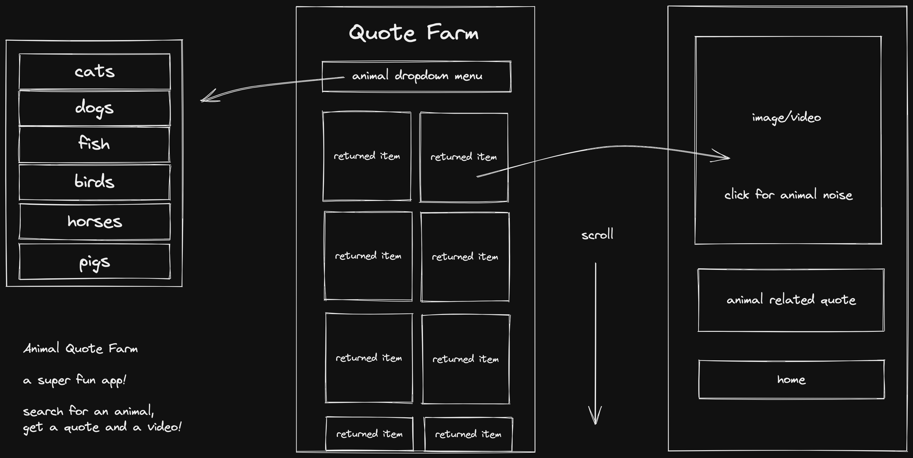
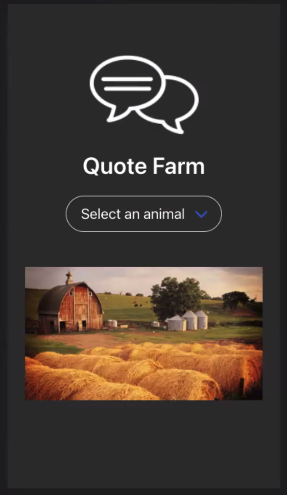
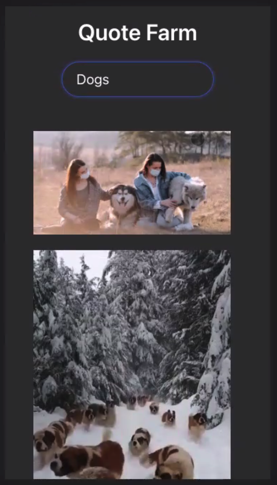
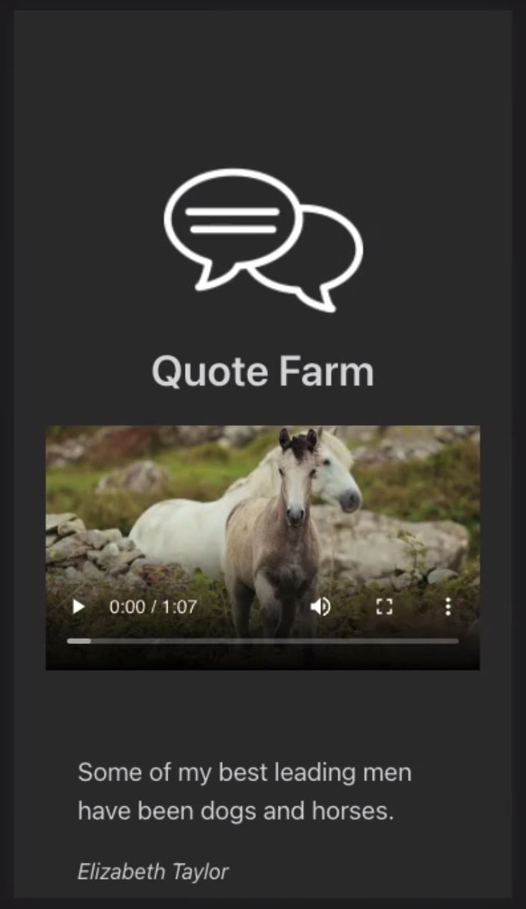

# Quote Farm

#### JT Black & Marco Manunta
_Quote Farm_ is a fun app that allows a user to choose an animal and get a video and related quote about that animal. It was my second project while attending General Assembly's Software Intensive Engineering course. The project, a mobile-first, React-powered single-page app, was a team effort with another member of the SEI62 cohort, [Marco Manunta](https://github.com/frozenborder72), and was built over 2 days.


## Planning & Wireframe
We used Excalidraw to wireframe the app, write some psuedo-code, and plan the user experience.

<p style="border: 1px solid white">

</p>

## Application Walkthrough
### Home Page
<p align="center">
  
</p>

### Animals Page
<p align="center">
  
</p>

### Quote & Video Page
<p align="center">
  
</p>


### Project Duration: 
- Pair, 2 Days

### Stack:
- HTML 
- CSS/SASS 
- JavaScript 
- React 

### Deployed App:
Try [Quote Farm](https://quote-farm.netlify.app/)

## The Brief
Our brief was to create a web app that: 
- consumes a public API 
- uses several React components 
- uses Axios router and has several pages 
- supply a wireframe
- was to be publicly deployed.

## Day 1

We started by looking for some interesting APIs, and after some investigation we discovered that many APIs would have issues with CORS, registration, paying, call-limits, and availability. We decided to use two APIs - one for supplying cute animal videos and another for supplying quotes . We wanted the user to select an animal, and then we would return a selection of videos of that animal and a random quote that was associated with the chosen animal. We added a little easter egg - an animal noise generated when the video field was clicked on.

We jumped into building the logic for returning the animal videos. There was a CORS issue of course, and we were on the verge of giving up and just using pics when we received the suggestion to try a proxy server. Once that was implemented we were able to return the videos.

The next thing was to return a quote that contained the animal. We went to a second API for that and returned a random animal-associated quote in the video window when the user clicked on the video thumbnail. We added the easter egg sounds.

## Day 2

Day 2 we spent several hours dealing with the learning curve of Bulma syntax, and got most of the styling sorted. We added a masonry library to make the thumbnails look nicer, as they were all different random sizes and rather than returning images based on proportions we thought it best to constrain them in thumbnail screen.
We opened up the code on Friday morning, had a big coffee, and were ready to submit before lunch!

## Code Snippets
```

```
##Challenges
The Cross Origin Resource security issue caused us headaches for about half a day. We also had issues trying to use multiple sounds at once.
##Wins
We were happy that most of the stuff worked right away. When we got the proxy server solution to our CORS issue we were happy and ready to deliver MVP.
##Future Features
We wanted to add the choice of selecting either an image or a video. Adding more sounds.

